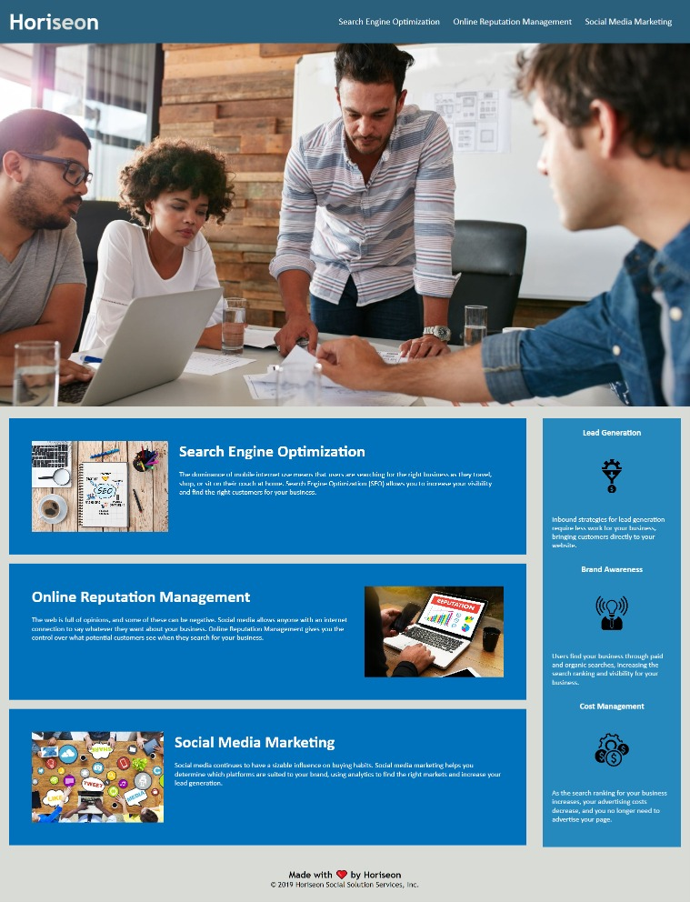

## Week 1 Homework (HMTL CSS Git: Code Refactor)

## Description 

This mock website is for the company "Horiseon." The starter code for the site was modified to incorporate semantic HTML elements. These elements include: body, header, footer, nav, main, figure, aside, and section. Additionally, the alt and title attributes were used to add descriptions to the images on the page. The screen reader ChromeVox was used to test the accessiblity of the site. Comments were added to the CSS file to describe what each element does.  

## Table of Contents

* [Description](#Description)
* [Table of Contents](#Table-of-Contents)
* [Photo](#Photo)
* [Installation](#Installation)
* [Usage](#Usage)
* [Credits](#Credits)
* [License](#License)
* [Badges](#Badges)
* [Contributing](#Contributing)
* [Tests](#Tests)

## Photo

* [Return to Top](#Week-1-Homework-(HMTL-CSS-Git:-Code-Refactor))

## Installation

There is nothing to install to access the information on this website. 

* [Return to Top](#Week-1-Homework-(HMTL-CSS-Git:-Code-Refactor))

## Usage 

I recommend reading the website to learn about the company "Horiseon." The three sub-headings in the header (Searh Engine Optimization, Online Reputaion Management, and Social Media Marketing), are links that will bring you to the corresponding section of the page. 

* [Return to Top](#Week-1-Homework-(HMTL-CSS-Git:-Code-Refactor))

## Credits

No credits

* [Return to Top](#Week-1-Homework-(HMTL-CSS-Git:-Code-Refactor))

## License

No licenses used or implied 

* [Return to Top](#Week-1-Homework-(HMTL-CSS-Git:-Code-Refactor))

## Badges

No badges 

* [Return to Top](#Week-1-Homework-(HMTL-CSS-Git:-Code-Refactor))

## Contributing

Jeremy Rice

* [Return to Top](#Week-1-Homework-(HMTL-CSS-Git:-Code-Refactor))

## Tests

No tests

* [Return to Top](#Week-1-Homework-(HMTL-CSS-Git:-Code-Refactor))